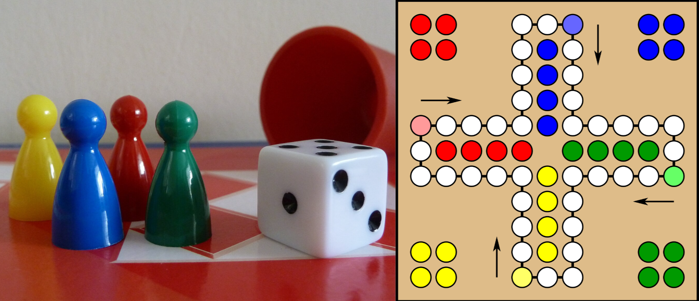

---
tags:
  - OOP1-Övning
---

# Övning 07 Klasser

## Lärandemål

* Förstå varför klasser är användbara (samlar data + beteende).
* Förstå hur en enkelt klass skapas (Contact).
* Förstå hur objekt skapas från en klass med keywordet `new`.
* Testa att refaktorera kod.

## Steg 1
#### Klass, objekt och fält

Denna uppgift utgår från koden i [Övning 07 Förbered](./exercises07.md).

1. Tänk igenom varför det är problematiskt att, som i den förberedande övningen, lagra namn och telefonnummer i två separata listor. Hur blir det om vi lägger till en massa andra fält, så som adress, e-post, födelsedag osv? 

> Försök att se att alla dessa fält hör ihop, *som en sak*, **en kontakt**.

2. Skapa en klass som heter `Contact`. Till en början kan den inenhålla två publika fält:
    * `public string name;`
    * `public string phone;`

3. Skapa en lista som ska hålla objekt av typen `Contact`:
    ```csharp
    List<Contact> contacts = new List<Contact>();
    ```

!!! Info "Fundering"
    **Fundering: ** Var bör denna lista ligga i vår kod? Inne i `Main`-metoden, eller som ett fält i `Program`-klassen? (Tips: tänk på att vi vill kunna använda den i flera olika metoder.)

4. Refaktorera koden från den förberedande övningen så att den använder `Contact`-klassen och `List<Contact>`. Där användaren matar in information skall ett nytt `Contact`-objekt skapas och läggas in i listan. När alla kontakter skrivs ut, skall informationen hämtas från `Contact`-objekten i listan. Du ska med andra ord helt ta bort de två ursprungliga listorna `names` och `phones`, och bara använda den nya listan samt skapa ett nytt objekt varje gång en kontakt läggs till. 

***Det kan ta ett tag att komma in i tankesättet med klasser och att skapa nya objekt.***

---

# Nu, en liten paus från kodandet!

För att kunna bygga ett system med en objektorienterad approach behöver vi kunna identifiera de olika delarna av systemet och hur de hänger ihop.

* Identifiera objekt i systemet
* Identifiera relationer och ansvar mellan objekten
* Identifiera attribut och metoder för objekten

## Uppgift 1 - Fysiskt system

Tänk dig att vi ska skapa ett digitalt spel baserat på det riktiga spelet [Fia med Knuff](https://sv.wikipedia.org/wiki/Fia_(br%C3%A4dspel)). Vad för faktiska saker finns med i det spelet?

??? Info "Vad är Fia med Knuff?"
    Fia med knuff, är ett brädspel för 2–4 spelare. Varje spelare har fyra spelpjäser i varsitt bo och målet är att med utgång från tärningskast flytta sina pjäser från boet, ett varv medsols runt spelplanen och slutligen in i mitten, med utgång från tärningskast. Den som först når mitten med samtliga pjäser vinner. För att få kliva ur boet krävs en sexa, ibland går det även bra med en etta.[4] Det är tillåtet att ha flera pjäser i spel utanför sitt bo, däremot får man bara flytta en pjäs per tärningskast. Pjäsernas färger är röd, blå, gul och grön. Fia med knuff innebär att om man hamnar på samma spelruta som en motspelare, "knuffar" man ut motståndarens spelpjäs. Det betyder att motspelaren får börja om från sitt bo med spelpjäsen. Spelrutorna som leder in i mitten av spelplanen är "säker mark" och man kan därför inte bli utknuffad där.

    

### **1. Identifiera objekt**

* Fundera över vilka delar i Fia med Knuff som kan bli objekt i vår digitala version av spelet.
* Skriv ner minst fem olika objekt som du tror behövs för att vi ska kunna simulera spelet.

### **2. Relationer och ansvar**

För varje objekt ni hittar, svara på:

* Vilka andra objekt har det här objektet en relation till? På vilket sätt relaterar de? 
* Vilket ansvar har objektet? (Vad behöver det "veta" eller kunna göra?)

### **3. Egenskaper**

Försök nu att identifiera några egenskaper som dessa objekt kan tänkas ha. Färger, positioner, storlekar, namn, antal av olika saker osv.

### **4. Metoder**

Här kommer tidigare ansvarsområden in i bilden. Vad behöver objekten kunna göra? Vilka metoder kan de tänkas ha? Vilka objekt "gör" saker och vilka objekt är mer passiva?

### **5. Sammanställning**

Rita ett enkelt "klassdiagram" över de objekt ni identifierat. Papper och penna räcker gott, men digitalt funkar också.

* Rita lådor med objekten. Namnet högst upp och inne i lådan några av de viktigaste egenskaperna i den övre halvan och några av de viktigaste metoderna i den nedre halvan.
* Rita pilar mellan objekten för att visa relationer. Skriv gärna en kort beskrivning av relationen vid pilen.

> Titta på sammanställningen och ställ er frågan: Har vi fått med alla viktiga objekt? Har vi missat något objekt som kanske inte är så självklart? Är det några objekt som är onödiga? Har vi fått med de viktigaste egenskaperna och metoderna?

Vill du se ett exempel på hur klassdiagram kan se ut? Kolla in [denna sida om UML](../../../../material/general/methodology/uml.md).

## Uppgift 2 - Digitalt system

Nu ska vi titta på ett digital system utan en direkt fysisk motsvarighet. Det kan vara lite svårare att identifiera objekt i ett sådant, eftersom det inte alltid finns en motsvarighet i verkligeheten för allt vi behöver i ett sånt system.

Här är ett förslag på olika digitala system. Välj ett av dem, eller hitta på ett eget. Använd sedan samma process som i uppgift 1 för att identifiera objekt, relationer, egenskaper och metoder.

* En app för att skapa och dela recept
* Ett kassasystem i en butik
* Ett bibliotekssystem för att låna och återlämna böcker
* Ett system för att hantera anställda i ett företag
* Ett system för att hantera närvaro, ledighet och sjukfrånvaro
* En journaling-app för att skriva dagbok, hålla koll på humör och vanor
