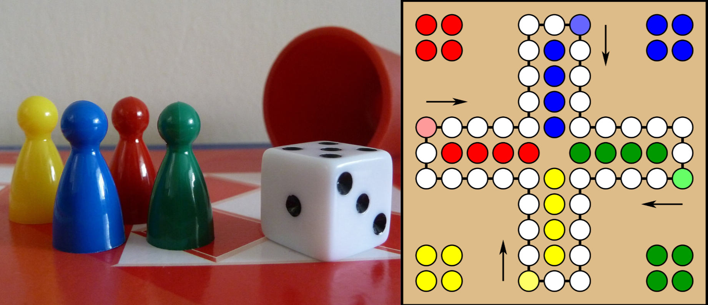

---
tags:
  - OOP1-Övning
---

# Övning 08 OOP Design

För att kunna bygga ett system med en objektorienterad approach behöver vi kunna identifiera de olika delarna av systemet och hur de hänger ihop.

* Identifiera objekt i systemet
    * Vilka "saker" finns i systemet? Om du provar att beskriva i text vad systemet ska kunna göra, och sedan leta efter vilka substantiv som finns i texten, så är det ofta ett bra sätt att hitta potentiella objekt.
* Identifiera relationer och ansvar mellan objekten
    * Vilka objekt har en relation till vilka andra objekt? På vilket sätt relaterar de? Vilka objekt kan existera själva, och vilka kräver att andra objekt redan finns för att de ska kunna existera?
* Identifiera attribut och metoder för objekten
    * Vilka egenskaper kan objekten tänkas ha? Färger, positioner, storlekar, namn, antal av olika saker osv.
    * Vad behöver objekten kunna göra? Vilka metoder kan de tänkas ha? Vilka objekt "gör" saker och vilka objekt är mer passiva?

## Uppgift 1 - Fysiskt system

Tänk dig att vi ska skapa ett digitalt spel baserat på det riktiga spelet [Fia med Knuff](https://sv.wikipedia.org/wiki/Fia_(br%C3%A4dspel)). Vad för faktiska saker finns med i det spelet?

??? Info "Vad är Fia med Knuff?"
    # Fia med knuff – spelregler i korthet

    **Fia med knuff** är ett brädspel för **2–4 spelare**.  

    - Varje spelare har **fyra pjäser** i sitt bo.  
    - Målet är att med hjälp av tärningskast flytta sina pjäser:  
    1. Ut från boet  
    2. Ett varv medsols runt spelplanen  
    3. In i mitten  

    Den som först får in **alla sina pjäser i mitten** vinner spelet.

    ## Regler
    - För att lämna boet krävs en **sexa** (ibland även en etta).  
    - Man får bara flytta **en pjäs per tärningskast**.  
    - Det är tillåtet att ha flera pjäser ute på spelplanen.  
    - Pjäsernas färger är **röd, blå, gul och grön**.  

    ## “Knuffa” motståndaren
    - Om du hamnar på samma ruta som en motspelare, **knuffas motståndarens pjäs tillbaka till sitt bo**.  
    - Rutor som leder in i mitten är **säker mark** – där kan man inte bli utknuffad.

    

### **1. Identifiera objekt**

* Fundera över vilka delar i Fia med Knuff som kan bli objekt i vår digitala version av spelet.
* Skriv ner minst fem olika objekt som du tror behövs för att vi ska kunna simulera spelet.

### **2. Relationer och ansvar**

För varje objekt ni hittar, svara på:

* Vilka andra objekt har det här objektet en relation till? På vilket sätt relaterar de? 
* Vilket ansvar har objektet? (Vad behöver det "veta" eller kunna göra?)

### **3. Egenskaper**

Försök nu att identifiera några egenskaper som dessa objekt kan tänkas ha. Färger, positioner, storlekar, namn, antal av olika saker osv.

### **4. Metoder**

Här kommer tidigare ansvarsområden in i bilden. Vad behöver objekten kunna göra? Vilka metoder kan de tänkas ha? Vilka objekt "gör" saker och vilka objekt är mer passiva?

### **5. Sammanställning**

Rita ett enkelt "klassdiagram" över de objekt ni identifierat. Papper och penna räcker gott, men digitalt funkar också.

* Rita lådor med objekten. Namnet högst upp och inne i lådan några av de viktigaste egenskaperna i den övre halvan och några av de viktigaste metoderna i den nedre halvan.
* Rita pilar mellan objekten för att visa relationer. Skriv gärna en kort beskrivning av relationen vid pilen.

> Titta på sammanställningen och ställ er frågan: Har vi fått med alla viktiga objekt? Har vi missat något objekt som kanske inte är så självklart? Är det några objekt som är onödiga? Har vi fått med de viktigaste egenskaperna och metoderna?

Vill du se ett exempel på hur klassdiagram kan se ut? Kolla in [denna sida om UML](../../../../material/general/methodology/uml.md).

---

## Uppgift 2 - Digitalt system

Nu ska vi titta på ett digital system utan en direkt fysisk motsvarighet. Det kan vara lite svårare att identifiera objekt i ett sådant, eftersom det inte alltid finns en motsvarighet i verkligeheten för allt vi behöver i ett sånt system.

Här är ett förslag på olika digitala system. Välj ett av dem, eller hitta på ett eget. Använd sedan samma process som i uppgift 1 för att identifiera objekt, relationer, egenskaper och metoder.

??? Info "En app för att skapa och dela recept"
    Tänk dig en app där användare kan skriva in sina egna recept.  

    * Det ska gå att lägga till ingredienser till recepten, och hur mycket av de olika sakerna. 
    * Det ska gå att skriva en instruktion för hur receptet tillagas. 
    * Recepten kan delas med andra användare, som i sin tur kan lämna kommentarer eller sätta ett betyg. 
    * Kanske kan det gå att skapa en inköpslista baserat på ett recept också? 
    * Kanske går det att skriva in kostnader för recepten och få en uppskattning av hur mycket det kostar att laga dem beroende på antalet portioner?

??? Info "Ett kassasystem i en butik"
    I en butik använder personalen ett kassasystem för att registrera varor som en kund köper.
    
    * Varje vara har ett pris och en produktkod.  
    Kunden gör en beställning, systemet beräknar en totalsumma och betalningen sker med ett betalmedel, till exempel kort, kontanter eller swish.  
    Ett kvitto skrivs ut i slutet.

??? Info "Ett bibliotekssystem"
    I ett bibliotek finns många böcker som kan lånas ut till en låntagare.  
    För att låna behövs ett lånekort, och varje lån registreras med datum för utlån och datum för återlämning.  
    En bibliotekarie ansvarar för att registrera lån och återlämning.  
    Systemet kan också hålla reda på om en bok är ledig eller utlånad.

??? Info "Ett system för att hantera anställda"
    Ett företag har många anställda, och varje anställd har ett namn, en anställningsform, en lön och ett anställningsdatum.  
    Systemet kan också lagra information om avdelningar, projekt som de jobbar i, och vem som är deras chef.  
    När någon slutar behöver systemet uppdateras.

??? Info "Ett system för närvaro, ledighet och sjukfrånvaro"
    I en kommunorganisation behöver man hålla koll på närvaro och frånvaro.  
    Varje person har ett schema med dagar och tider.  
    I systemet kan man markera närvarande, sjukfrånvaro eller semester.
    Frånvara kan ha olika orsaker, t.ex. sjukdom, semester, föräldraledighet eller annan ledighet.
    Det kan läggas in anteckningar för varje dag.
    En administratör eller lärare kan skapa rapporter över närvaron.

??? Info "En journaling-app"
    En journaling-app låter användare skriva inlägg som sparas dag för dag.  
    Varje inlägg kan ha datum, text, humör och eventuellt en tagg för att beskriva känslor eller aktiviteter.  
    Appen kan också visa en översikt eller statistik över användarens humör och vanor över tid.

??? Info "Hogwarts School of Witchcraft and Wizardry"
    Tänk dig att du ska skapa ett system för att hantera elever, lärare, kurser och betyg på Hogwarts.  
    Elever kan vara med i olika elevhem (Gryffindor, Hufflepuff, Ravenclaw, Slytherin) och delta i olika aktiviteter som Quidditch.  
    Lärare undervisar i olika ämnen och sätter betyg på elevernas prestationer.
    Betygen i kurserna graderas med Outstanding, Exceeds Expectations, Acceptable, Poor och Dreadful.
    Systemet kan också hålla reda på magiska varelser och artefakter som finns på skolan.

??? Info "Saurons HR system"
    Sauron behöver ett system för att hantera sina orcher och andra tjänare.  
    Varje tjänare har en roll (t.ex. krigare, spion, byggare), en styrka, en lojalitetsnivå och en uppdragsstatus.  
    Systemet kan också hålla reda på vilka uppdrag som är pågående, vilka som är slutförda och vilka som misslyckats.
    Det är viktigt att hålla koll på utrustning också, orcher är inte kända för att hålla reda på sina saker.
    Systemet kan också hantera rekrytering av nya tjänare och avskedande av de som inte längre är lojala.

