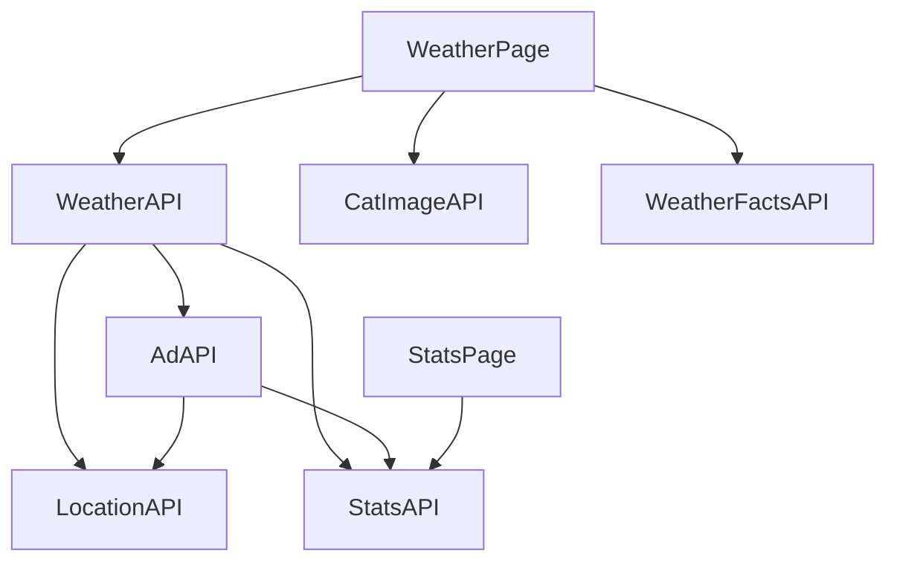

# Workshop 2

I denna uppgift kommer ni att arbete i små grupper, där varje grupp har ansvaret över att skapa ett visst WebAPI. Dessa APIer kommer att användas utan två webbsidor. Vissa APIer kommer bara att användas av andra APIer också.

Grundtanken är:

* En vädersökningssida där användaren kan söka på en stad och få upp aktuell väderdata.
* Sidan skall visa relevant reklam
* Sidan skall samla statistik på vilka städer som söks mest på
* Sidan skall också visa en random bild på en katt samt ett väder-relaterat citat eller "Visste du att..."-fakta
* Eventuellt kan något annat ingå också, om ni kommer på något kul.
* En statistiksida som visar de mest sökta städerna, separat från vädersökningssidan och använder bara StatsAPI.

APIerna är följande:

* WeatherAPI: `GET /api/weather/{city}`. Svarar med JSON om den aktuella staden. Informationen som ska ingå är datum, temperatur, väderbeskrivning (soligt, molnigt etc) och vindhastighet, samt longitud och latitud. Gör en egen liten databas med några städer och väderdata för dessa. Denna API ska inte kontakta någon extern tjänst. För att få tag på long och lat för staden, kontakta LocationAPI (se nedan).
* AdAPI: `GET /api/ad/{lon}/{lat}`. Svarar med en reklamtext baserat på longitud och latitud. Gör en egen liten databas med några reklamtexter samt kanske också bilder och vilken breddgrad de hör till. Exempelvis så att en vissa ad visas för alla norr om Stockholm, en annan i södra Sverige. För att få tag på lon och lat för staden, kontakta LocationAPI (se nedan). Kan möjligen också kontakta StatsAPI för att se om staden är populär eller inte, och anpassa reklamen efter detta (ändra pris tex).
* StatsAPI: `POST /api/stats`. Tar emot JSON med vilken stad som söktes på samt vilket IP som gjorde requesten, och sparar detta i en databas. `GET /api/stats/top` som svarar med de 5 mest sökta städerna. `GET /api/stats/all` som svarar med all statistik.
* LocationAPI: `GET /api/location?city={stadsnamn}`. Svarar med stadens longitude och latitude i JSON, beroende på stadens namn. Gör en egen liten databas med några städer och deras koordinater. Går att ladda ner online.
* CatImageAPI: `GET /api/cats/random`. Svarar med en URL till en slumpmässig bild på en katt. Se till att ha lite katbilder, använda static files i WebAPI-projektet.
* WeatherFactsAPI: `GET /api/facts/random`. Svarar med ett slumpmässigt väderrelaterat citat eller "Visste du att..."-fakta. Gör en egen liten databas med några fakta/citat.

En bild i mermaid-kod över detta system, där hemsidorna är vita och apierna är blå:

