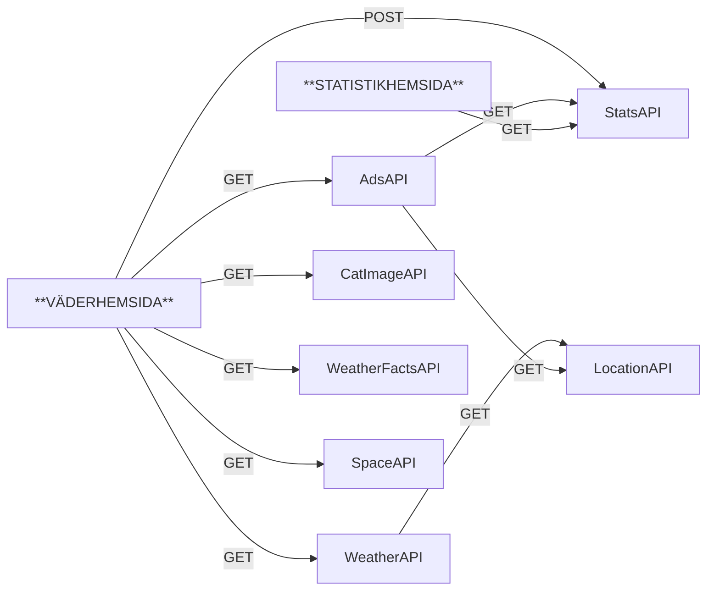

# Workshop 2

I denna uppgift kommer ni att arbete i små grupper, där varje grupp har ansvaret över att skapa ett visst WebAPI. Dessa APIer kommer att användas utan två webbsidor. Vissa APIer kommer bara att användas av andra APIer också.

Grundtanken är:

* En vädersökningssida där användaren kan söka på en stad och få upp aktuell väderdata.
* Sidan skall visa relevant reklam
* Sidan skall samla statistik på vilka städer som söks mest på
* Sidan skall också visa en random bild på en katt samt ett väder-relaterat citat eller "Visste du att..."-fakta
* Eventuellt kan något annat ingå också, om ni kommer på något kul.
* En statistiksida som visar de mest sökta städerna, separat från vädersökningssidan och använder bara StatsAPI.

APIerna är följande:

* **WeatherAPI:** `GET /api/weather/{city}`. Svarar med JSON om den aktuella staden. Informationen som ska ingå är datum, temperatur, väderbeskrivning (soligt, molnigt etc) och vindhastighet, samt longitud och latitud. Gör en egen liten databas med några städer och väderdata för dessa. Denna API ska inte kontakta någon extern tjänst. För att få tag på long och lat för staden, kontakta LocationAPI (se nedan).
* **AdAPI:** `GET /api/ad/{lon}/{lat}`. Svarar med en reklamtext baserat på longitud och latitud. Gör en egen liten databas med några reklamtexter samt kanske också bilder och vilken breddgrad de hör till. Exempelvis så att en vissa ad visas för alla norr om Stockholm, en annan i södra Sverige. För att få tag på lon och lat för staden, kontakta LocationAPI (se nedan). Kan möjligen också kontakta StatsAPI för att se om staden är populär eller inte, och anpassa reklamen efter detta (ändra pris tex).
* **StatsAPI:** `POST /api/stats`. Tar emot JSON med vilken stad som söktes på samt vilket IP som gjorde requesten, och sparar detta i en databas. `GET /api/stats/top` som svarar med de 5 mest sökta städerna. `GET /api/stats/all` som svarar med all statistik.
* **LocationAPI:** `GET /api/location?city={stadsnamn}`. Svarar med stadens longitude och latitude i JSON, beroende på stadens namn. Gör en egen liten databas med några städer och deras koordinater. Går att ladda ner online.
* **CatImageAPI:** `GET /api/cats/random`. Svarar med en URL till en slumpmässig bild på en katt. Se till att ha lite katbilder, använda static files i WebAPI-projektet.
* **WeatherFactsAPI:** `GET /api/facts/random`. Svarar med ett slumpmässigt väderrelaterat citat eller "Visste du att..."-fakta. Gör en egen liten databas med några fakta/citat.
* **SpaceAPI:** `GET /api/space/weather`. Svarar med rymdväderdata, exempelvis solstormar, geomagnetiska stormar etc. Gör en egen liten databas med några rymdväderdata.

Så här hänger allt ihop:



## Startkod

!!! tip "Börja med API-definitionen"
    Det är viktigt att tidigt definera hur API:et ske se ut och vilka endpoints som ska finnas. Diskutera i gruppen och skriv ner detta i README-filen i repot. Skriv exempelvis så här:
    ```
    ## API Endpoints
    - `GET /api/weather/{city}`: Returnerar aktuell väderdata för staden {city}.

    JSON-svar:
    ```json
    {
        "date": "2024-06-01",
        "temperature": 22,
        "description": "Soligt",
        "windSpeed": 5,
        "longitude": 18.0649,
        "latitude": 59.3326
    }
    ```


1. Börja projektet genom att skapa ett repo för gruppen på GitHub. Bjud in de andra medlemmarna. Döp repot till det API ni valt, exempelvis WeatherAPI.
2. En person skapar ett nytt ASP.NET Core WebAPI-projekt med `dotnet new webapi`, lägg till en .gitignore och initiera ett GIT-repo. Pusha repot till det tomma repot på GitHub (följ instruktionerna på GitHub).
3. Lägg till de EntityFramework Core NuGet-paketen som behövs:

    ```bash
    dotnet add package Microsoft.EntityFrameworkCore.Sqlite
    dotnet add package Microsoft.EntityFrameworkCore.InMemory
    ``` 
4. Lägg in följande startkod i Program.cs:

```cs
using Microsoft.EntityFrameworkCore;

var builder = WebApplication.CreateBuilder(args);

// Lägg till den DbContext ni skapar för er databas här
// builder.Services.AddDbContext<ApiDbContext>(options =>
//    options.UseInMemoryDatabase("EventDb"));

//Låt detta vara kvar! Utan denna inställning kommer inte websidan att få access till API:et.
// Läs mer här: https://developer.mozilla.org/en-US/docs/Web/HTTP/Guides/CORS
builder.Services.AddCors(options =>
{
    options.AddDefaultPolicy(policy =>
    {
        policy.AllowAnyOrigin()
              .AllowAnyMethod()
              .AllowAnyHeader();
    });
});

var app = builder.Build();

// Denna hör ihop med CORS-inställningen ovan
app.UseCors();

//Ni ska inte skriva era endpoints här i Program.cs utan i separata controllers, så använd denna:
app.MapControllers();

app.Run();

```

Simpelt exempel på en API-controller:

```cs
using Microsoft.AspNetCore.Mvc;

[ApiController]
[Route("api/v1")]
public class SampleController : ControllerBase
{
    [HttpGet("hello")]
    public IActionResult GetHello()
    {
        return Ok("Hello from SampleController!");
    }
}
```


