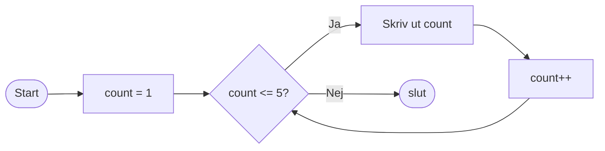

# Iteration

Iteration, eller loopar som det ofta kallas, används för att upprepa ett kodblock flera gånger *så länge ett visst villkor är uppfyllt*. 

Detta är otroligt vanligt inom programmering, och det är viktigt att förstå hur det fungerar.

Gemensamt för alla loopar är att de:

* Har ett villkor som avgör om loopen ska fortsätta eller inte.
* Har ett kodblock som körs varje gång loopen itererar (upprepar sig).

Alltså strukturellt kan det se ut så här:

```
looptyp (villkor)
{
    // Kod som körs så länge villkoret är sant
}
```

#### While

Den enklaste loopen är *while*-loopen. Den körs så länge ett villkor är sant. Här är det enklaste exemplet:

```csharp
while (true)
{
    Console.WriteLine("En evighetsmaskin!");
}
```
!!! warning "Oändliga loopar"
    En loop som aldrig slutar kallas för en oändlig loop. Om du behöver avbryta ett program som fastnat i en oändlig loop kan du ofta göra det med `Ctrl+C` i terminalen.

Vanligare är att använda någon form av räknare för att hålla koll på hur många gånger loopen har körts. Här är ett exempel som skriver ut talen 1 till 5:

```csharp
int count = 1; // Startvärde
while (count <= 5) // Villkor
{
    Console.WriteLine(count); // Kod som körs varje gång
    count++; // Uppdatera räknaren
}
```

#### Do-while

Det finns också *do-while*-loopen, som är likadan som *while* med den skillnanden att den alltid körs minst en gång, eftersom villkoret kollas efter att koden har körts:

```csharp
int count = 1;
do
{
    Console.WriteLine(count);
    count++;
} while (count <= 5);
```

#### For

En annan vanlig loop är *for*-loopen, som är en mer kompakt version av *while*. Den innehåller startvärde, villkor och uppdatering av räknaren på samma rad:

```csharp
for (int count = 1; count <= 5; count++)
{
    Console.WriteLine(count);
}
```

Här är samma flöde visualiserat som ett flödesschema:



#### Foreach

Den sista sortens loop är *foreach*-loopen, som används för att iterera över (gå igenom) alla element i en samling, som en array eller en lista:

```csharp
string[] fruits = { "Apple", "Banana", "Cherry" };
foreach (string fruit in fruits)
{
    Console.WriteLine(fruit);
}
```

#### break / continue

Inom loopar kan du använda *break* för att avbryta loopen helt, och *continue* för att hoppa över resten av koden i loopen och gå direkt till nästa iteration.

```csharp
for (int i = 1; i <= 10; i++)
{
    if (i == 5)
    {
        break; // Avbryter loopen när i är 5
    }
    if (i % 2 == 0)
    {
        continue; // Hoppar över jämna tal
    }
    Console.WriteLine(i); // Skriver ut udda tal mindre än 5
}
```

## Fler exempel

??? "Testa lösenord med do-while"
    ```csharp
    do
    {
        Console.Write("Skriv lösenord: ");;
    } while (Console.ReadLine() != "password");

    Console.WriteLine("Grattis du är inloggad!");
    ```

??? "Loopa igenom en lista eller array"
    ```csharp
    string[] censureradeOrd = ["fisk", "räka", "hund", "katt", "apa"];

    for (int i = 0; i < censureradeOrd.Length; i++)
    {
        Console.WriteLine(censureradeOrd[i]);
    }

    //Identisk funktion fast med foreach:

    foreach (string ord in censureradeOrd)
    {
        Console.WriteLine(ord);
    }
    ```

