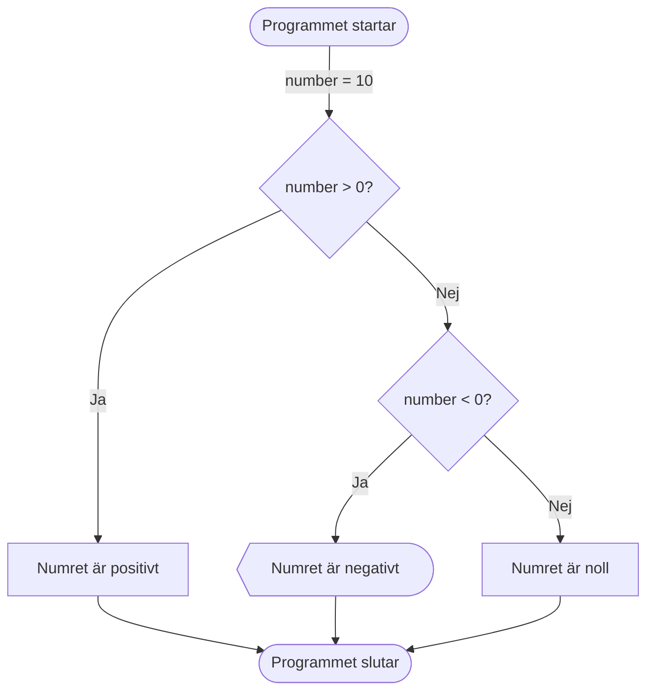

# Selektion

*If*, *else if* och *else* är grundläggande kontrollstrukturer i C# som används för att styra flödet av programmet baserat på villkor. De gör det möjligt att utföra olika kodblock beroende på om ett visst villkor är sant eller falskt.

Här är ett enkelt exempel som visar hur if, else if och else fungerar i C#:

```csharp
int number = 10;

if (number > 0)
{
    Console.WriteLine("Numret är positivt.");
}
else if (number < 0)
{
    Console.WriteLine("Numret är negativt.");
}
else
{
    Console.WriteLine("Numret är noll.");
}
``` 

Här är samma flöde visualiserat som ett flödesschema:




Det går att endast ha ett *if*-statement, utan *else if* eller *else*. Det går också att ha flera *else if*-satser för att kontrollera flera olika villkor. Några exempel:

??? tip "Endast if"
    ```csharp
        int number = 10;
        if (number > 0)
        {
            Console.WriteLine("Numret är positivt.");
        }
    ```

??? tip "Flera else if"
    ```csharp
    int number = 10;
    if (number > 0)
    {
        Console.WriteLine("Numret är positivt.");
    }
    else if (number < 0)
    {
        Console.WriteLine("Numret är negativt.");
    }
    else if (number == 10)
    {
        Console.WriteLine("Numret är exakt tio.");
    }
    else
    {
        Console.WriteLine("Numret är noll.");
    }
    ```

