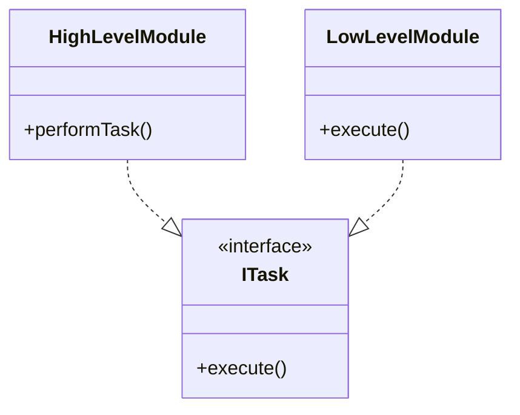

# SOLID

**SOLID** är fem grundprinciper för att skriva hållbar, tydlig och lätt-ändrad kod i objektorienterad programmering.
Varje bokstav står för en princip:

### **S**RP – Single Responsibility Principle

En klass ska ha **ett enda ansvar**. Den ska vara fokuserad på sitt syfte.

> Exempel: En `User`-klass ska bara hantera användardata, inte skicka e-post.

### **O**CP – Open/Closed Principle

Klasser ska vara öppna för utbyggnad men stängda för ändring.
Du ska kunna lägga till ny funktionalitet utan att ändra befintlig kod.

> Exempel: Använd arv eller interfaces för att lägga till nya beteenden.

### **L**SP – Liskov Substitution Principle

En underklass ska kunna ersätta sin basklass utan att programmet slutar fungera.

> Exempel: Om `Dog` är en subklass till `Animal`, ska du kunna använda en `Dog` var som helst där en `Animal` förväntas.

### **I**SP – Interface Segregation Principle

Skapa **flera små interfaces** istället för ett stort med många metoder. Detta för att klasser ska inte tvingas implementera metoder de inte behöver.

> Exempel: Istället för ett stort `IMachine`-interface, skapa `IPrinter`, `IScanner` osv.

### **D**IP – Dependency Inversion Principle

Koda mot abstraktioner, inte konkreta klasser.

> Exempel: Använd interfaces eller abstrakta klasser för att minska beroenden mellan klasser.

Det heter dependency inversion pga man vänder på beroendena, så att hög-nivå moduler (tex business-logik) inte beror på låg-nivå moduler (till exempel databas-access), utan båda beror på abstraktioner. 

DI-principen främjar lös koppling mellan komponenter i ett system, vilket gör det lättare att underhålla och testa koden.

Exempel:

Länk till mer info om DI: [Understanding the dependency inversion](https://er-abhishek-luthra.medium.com/understanding-the-dependency-inversion-principle-building-flexible-and-maintainable-software-fa32d117ff4c)

## Länkar:

* [Stefano Santilli - SRP](https://www.linkedin.com/pulse/single-responsibility-principle-stefano-santilli)
* [Stefano Santilli - OCP](https://www.linkedin.com/pulse/open-closed-principle-stefano-santilli)
* [Stefano Santilli - LSP](https://www.linkedin.com/pulse/squarerectangle-problem-stefano-santilli)
* [Stefano Santilli - ISP](https://www.linkedin.com/pulse/interface-segregation-principle-isp-stefano-santilli)
* [Stefano Santilli - DIP](https://www.linkedin.com/pulse/dependency-inversion-principle-stefano-santilli)