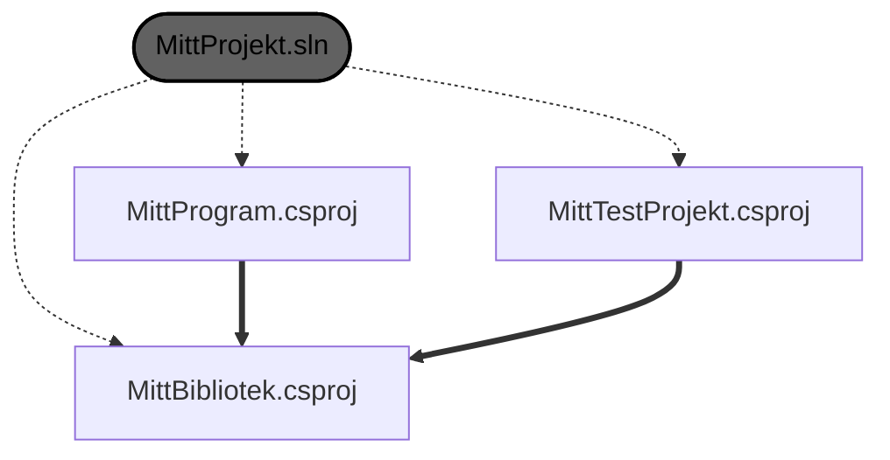

# Projektstruktur

Det enklaste sättet att ha ett .NET-projekt är att ha en enda `.csproj`-fil i roten av ditt projekt. Det är dock vanligt att dela upp koden i flera delprojekt, särskilt när projektet växer i storlek och komplexitet, eller om du vill ha ett testprojekt för [enhetstester](../../cs/testing/unittests.md)

## Solution (.sln)

En lösning (solution) i .NET är en samling av relaterade projekt som hanteras tillsammans. Du kan skapa en lösning med hjälp av kommandot `dotnet new sln` och sedan lägga till delprojekt med `dotnet sln add <sökväg-till-projekt>`. Med C# devkit brukar en lösning skapas automatiskt när du skapar ett nytt projekt med `dotnet new`.

## Sätta upp ett projekt med flera delprojekt

1. Börja med att skapa en solution-fil för ditt nya projekt:
    ```bash
    dotnet new sln -n MittProjekt
    cd MittProjekt
    ```

2. Skapa delprojekt:  
    ```bash
    dotnet new classlib -n MittBibliotek  
    dotnet new console -n MittProgram  
    dotnet new xunit -n MittTestProjekt  
    ```

3. Lägg till delprojekten i lösningen:
    ```bash
    dotnet sln add MittBibliotek/MittBibliotek.csproj
    dotnet sln add MittProgram/MittProgram.csproj
    dotnet sln add MittTestProjekt/MittTestProjekt.csproj
    ```

4. Lägg till referenser mellan delprojekten:
    ```bash
    dotnet add MittProgram/MittProgram.csproj reference MittBibliotek/MittBibliotek.csproj
    dotnet add MittTestProjekt/MittTestProjekt.csproj reference MittBibliotek/MittBibliotek.csproj
    ```

Du har nu en lösning med tre delprojekt: ett klassbibliotek (`MittBibliotek`), ett konsolprogram (`MittProgram`) som refererar till klassbiblioteket, och ett testprojekt (`MittTestProjekt`) som också refererar till klassbiblioteket för att kunna testa dess funktionalitet.

Ett diagram som visar hur det hänger ihop:

