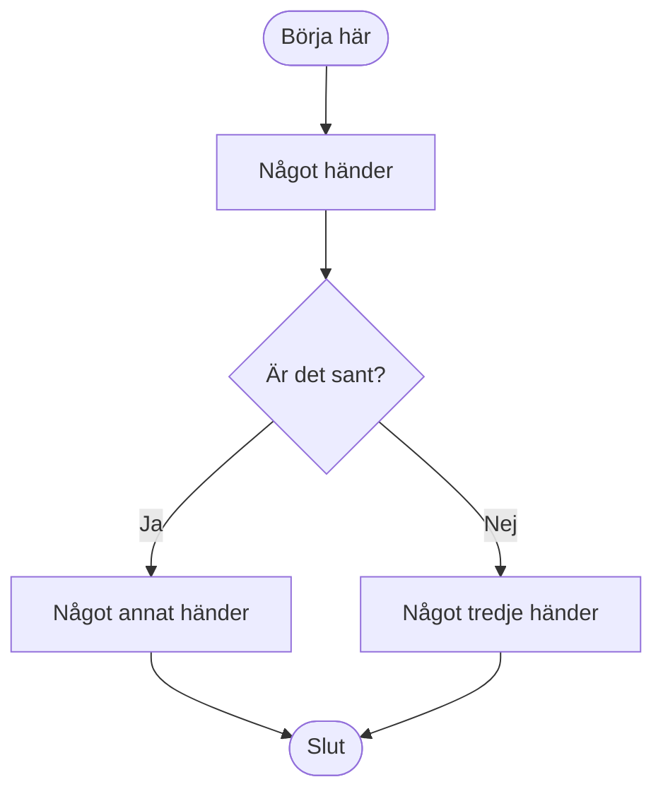
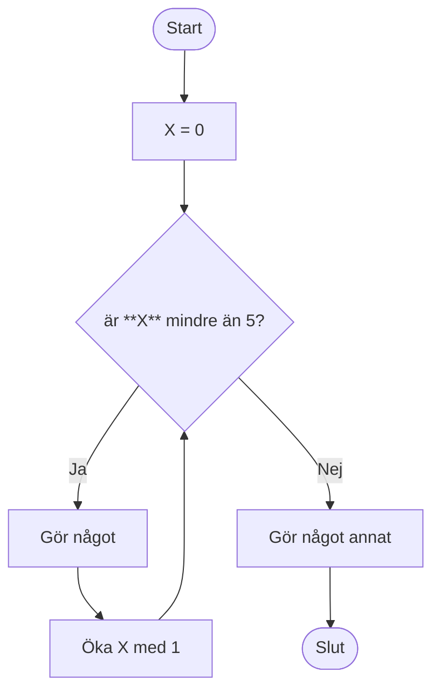
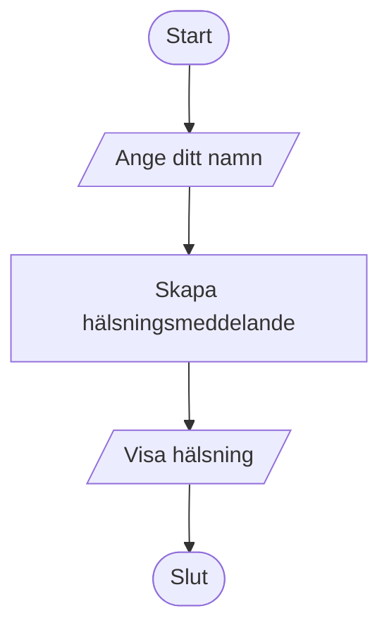
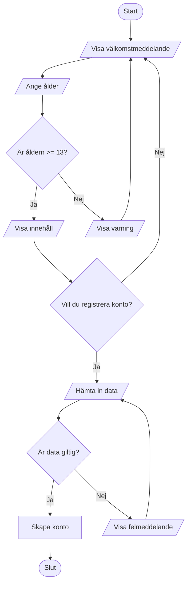

# Flowcharts

Flowcharts används för att visuellt representera flödet av en process eller ett system. De består av olika symboler som representerar olika typer av händelser i flödet, och pilar som visar åt vilket håll flödet går. De vanligaste symbolerna är:

* **Start/Stop** - Oval, används för att markera början och slutet av flödet.
* **Process** - Rektangel, används för att representera en åtgärd eller operation.
* **Val** - Diamant, används för att representera ett beslut som leder till olika vägar i flödet.
* **Input/Output** - Parallellogram, används för att representera inmatning eller utmatning av data.

## Exempel

Här är ett enkelt exempel på ett flödesschema som visar en beslutsprocess (detta visar egentligen hur if/else fungerar):

## Loop

Här är ett exempel på en while-loop som upprepas ett antal gånger innan flödet avslutas.

## Input/Output

Här är ett exempel som visar inmatning och utmatning av data.

## Mer avancerat exempel
Här är ett mer avancerat exempel som kombinerar flera element i ett flödesschema.

Det finns många fler olika fomer som används i flowcharts. Vill du läsa mer kan du titta här, och scrolla ner en bit: https://mermaid.js.org/syntax/flowchart.html