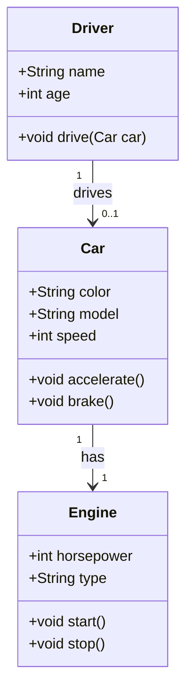

# UML

UML är ett sätt att visualisera objektorienterade system. Det kan vara ett bra sätt att planera och diskutera hur olika delar av ett system hänger ihop.

Exempel på klassdiagram kan se ut så här (Det ni ritar kan vara mycket enklare än detta):

Detta sätt att skriva klassdiagram på kallas för UML (Unified Modeling Language) och är ett vanligt sätt att visualisera objektorienterade system. I UML sätts +-tecknet framför attribut och metoder för att visa att de är publika (alltså åtkomliga från andra objekt).

Relationerna kan markeras på olika sätt. I exemplet ovan används "1" och "0..1" för att visa kardinalitet, alltså hur många av varje objekt som kan finnas i relationen. En bil har exakt en motor, en motor tillhör exakt en bil. En förare kan köra noll eller en bil. Ettan på drivers sida betyder att varje förare är en unik person. Om en förare på något sätt skulle kunna köra flera bilar samtidigt skulle det stå "0..*" på cars sida istället.