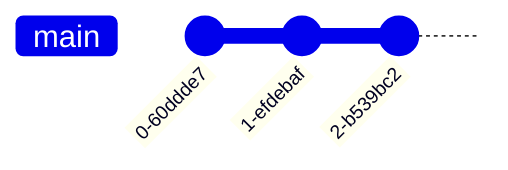
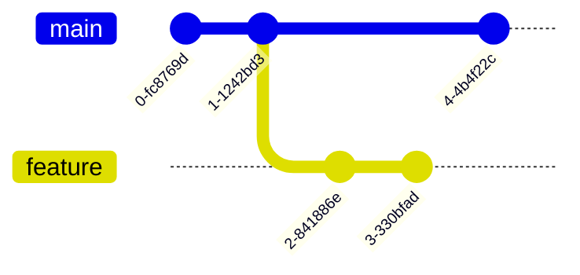

# Kom igång

1. Se till att du har installerat Git.
2. Gå till ett projekt som du vill använda Git med, eller skapa ett nytt.
3. I terminalen, initera ett nytt Git-repository med kommandot:
   ```bash
   git init
   ```
   Detta skapar en ny `.git`-mapp i ditt projekt, där Git kommer att lagra all information om versioner och ändringar. Om du tar bort den mappen så tas all din githistorik bort för det projektet, så var försiktig med den!
4. Innan du kan göra din första commit måste du se till så att Git vet vilka filer den ska hålla koll på. Det gör du med kommandot:
   ```bash
   git add .
   ```
   Detta lägger till alla filer som är i ditt projekt just nu till Git.
5. Nu är du redo att göra din första commit! Det gör du med kommandot:
   ```bash
    git commit -m "First commit"
    ```
    Detta sparar en "ögonblicksbild" av ditt projekt med ett meddelande som beskriver vad du har gjort. Du kan ersätta texten inom citattecknen med vad du vill.

!!! Tips "Obs!"
    Om du bara skriver `git commit` utan `-m` så öppnas en textredigerare där du kan skriva ett längre meddelande. Spara och stäng redigeraren när du är klar för att slutföra committen.

6. Nu har du gjort din första commit! På detta sättet kan du fortsätta göra ändringar i ditt projekt, lägga till dem med `git add`, och spara dem med `git commit` när du är nöjd. Glöm inte att skriva meningsfulla meddelanden för varje commit så att du lätt kan förstå vad som har ändrats senare (Detta är lättare sagt än gjort i början!).

Varje commit får ett unikt ID (en hash). Om vi visualiserar tre commits på main-branch kan det se ut så här:



Senare om du har skapat en branch för att testa en ny funktion, kan det se ut så här:



Om du senare vill slå ihop din feature-branch med main-branch kan det se ut så här:

