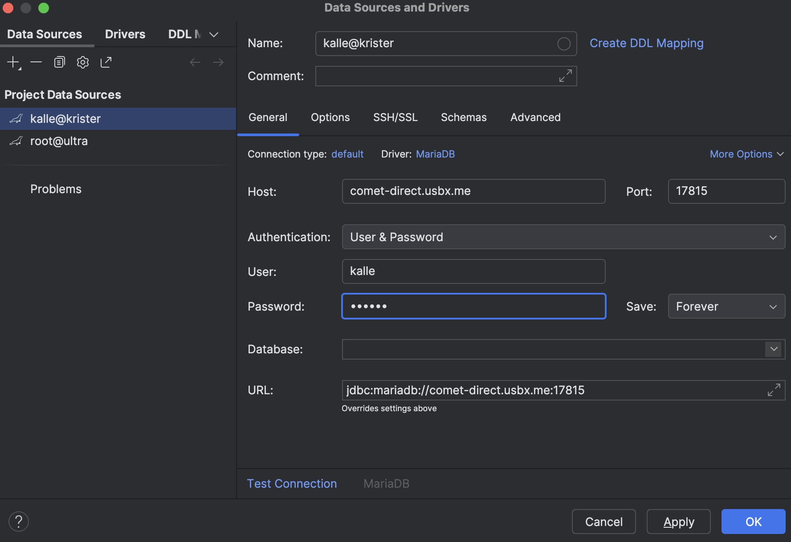
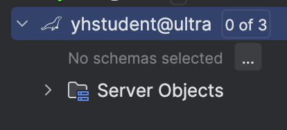
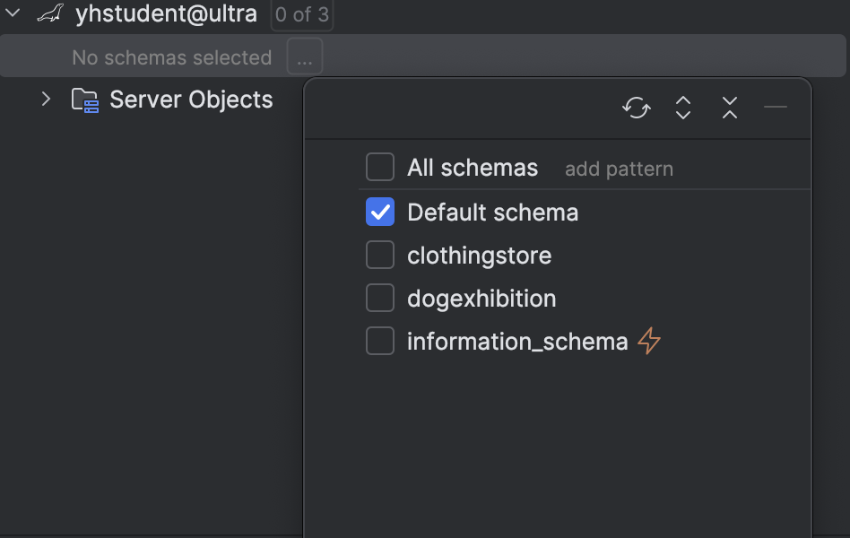
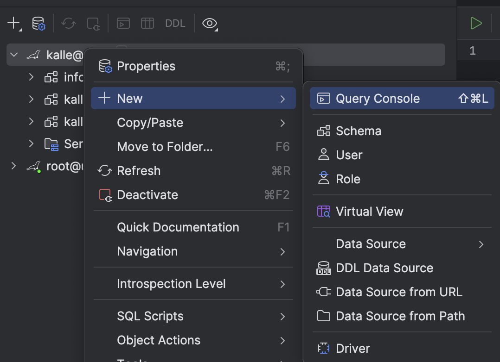
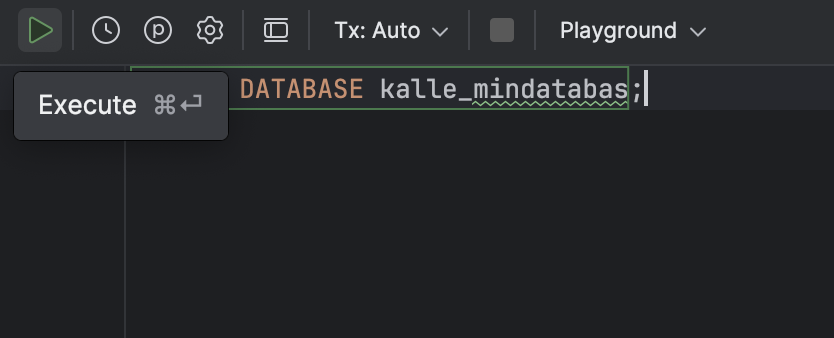

# DataGrip + MariaDB

[DataGrip](https://www.jetbrains.com/) är JetBrains databas-IDE.  
Här visar vi hur du kopplar upp dig mot en MariaDB-databas med ditt studentkonto.

## 1. Lägg till ny anslutning

Tryck på plustecknet i vänstra hörnet och välj ** New ** → ** Data Source** → **MariaDB**.  

Fyll i anslutningsuppgifterna:

- **Name**: `Kristers server` (döp till vad du vill, det sparas bara lokalt i DataGrip)
- **Host**: `comet-direct.usbx.me`
- **Port**: `17815`
- **User**: `yh_förnamn`
- **Password**: `hemligt`
- **Database**: kan lämnas tomt

Klicka sedan på **Download missing driver files** om DataGrip ber om det, så att **MariaDB-drivrutinerna** installeras.



Tryck **Test Connection** för att kontrollera att allt fungerar och välj sedan **OK**.

Om det inte funkar: läs felmeddelandet! Kanske har du fel användarnamn och lösenord?

---

## 2. Välj vilka scheman som ska visas

Efter att du sparat anslutningen ser du den i vänstermenyn i **Database Explorer**.

Klicka på texten “No schemas selected” för att välja vilka databaser (scheman) du vill se. Om du har ett helt nytt konto kanske du inte har några scheman eftersom du inte skapat några databaser.

Ett schema i en databas är en samling tabeller, vyer och andra objekt som hör ihop och organiserar data inom samma databas.





---

## 3. Öppna en SQL-konsol

Högerklicka på din anslutning → välj **New → Query Console**.  


Nu får du en editor där du kan skriva och köra SQL. Här kan du t.ex. skapa en ny databas med `CREATE DATABASE yh_förnamn_mindatabas`.



---

## 4. Skriv och kör SQL

I Query Console kan du skriva SQL och köra det med **⌘⏎ (Cmd+Enter)** på Mac eller **Ctrl+Enter** på Windows.

Exempel: skapa en databas (om du har behörighet):

```sql
CREATE DATABASE kalle_mindatabas;

