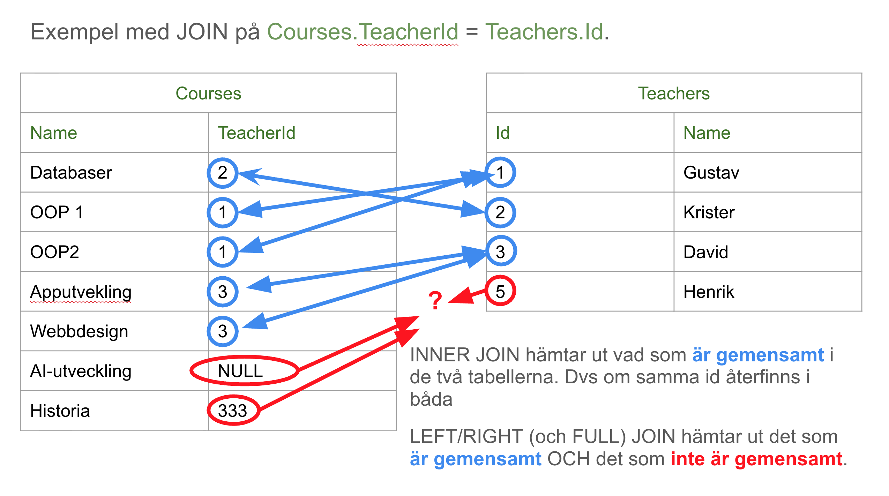

# JOIN

För att hämta data från flera tabeller samtidigt används `JOIN`. Vanligast är `INNER JOIN`, men det finns också `LEFT JOIN`, `RIGHT JOIN` och `FULL JOIN`.  

## Syntax
```sql
SELECT kolumn1, kolumn2, ...
FROM tabell1
JOIN tabell2 ON tabell1.kolumn = tabell2.kolumn;
```
## Exempel
Tänk dig att vi har följande två tabeller:

### Teachers
| Id | Name       | Email                |
|----|------------|----------------------|
| 1  | Gustav     | gustav@by.com   |
| 2  | Krister    | krister@by.com  |
| 3  | David      | david@by.com   |
| 4  | Lars       | lars@by.com   |
| 5  | Henrik     | henrik@by.com   |

### Courses
| Id | Name          | Credits | TeacherId |
|----|---------------|---------|-----------|
| 1  | Databaser     | 7.5     | 2         |
| 2  | OOP1          | 15      | 1         |
| 3  | OOP2          | 7.5     | 1         |
| 5  | Apputveckling | 10      | 3      |
| 8  | Webbdesign    | 10      | 3     |
| 9  | AI-utveckling | 10      | NULL     |
| 10 | Historia      | 10      | 333    |

### INNER JOIN
```sql
-- INNER JOIN: Hämta kurser och deras lärare
SELECT Courses.Name AS CourseName, Teachers.Name AS TeacherName
FROM Courses
INNER JOIN Teachers ON Courses.TeacherId = Teachers.Id;
```
Ger följande resultat:

| CourseName     | TeacherName |
|----------------|-------------|
| Databaser      | Krister     |
| OOP1           | Gustav      |
| OOP2           | Gustav      |
| Apputveckling  | David       |
| Webbdesign     | David       |


### LEFT JOIN
```sql
-- LEFT JOIN: Hämta alla kurser även om de inte har någon lärare
SELECT Courses.Name AS CourseName, Teachers.Name AS TeacherName
FROM Courses
LEFT JOIN Teachers ON Courses.TeacherId = Teachers.Id;
```
Ger följande result set:

| CourseName     | TeacherName |
|----------------|-------------|
| Databaser      | Krister     |
| OOP1           | Gustav      |
| OOP2           | Gustav      |
| Apputveckling  | David       |
| Webbdesign     | David       |
| AI-utveckling  | NULL        |
| Historia       | NULL        |

### RIGHT JOIN
```sql
-- RIGHT JOIN: Hämta alla lärare även om de inte har någon kurs
SELECT Courses.Name AS CourseName, Teachers.Name AS TeacherName
FROM Courses
RIGHT JOIN Teachers ON Courses.TeacherId = Teachers.Id;
```
Ger följande result set:

| CourseName     | TeacherName |
|----------------|-------------|
| OOP1           | Gustav      |
| OOP2           | Gustav      |
| Databaser      | Krister     |
| Apputveckling  | David       |
| Webbdesign     | David       |
| NULL           | Lars        |
| NULL           | Henrik      |

## Många till många-joins

En **många till många-relation** används när en rad i en tabell kan vara kopplad till flera rader i en annan tabell, och tvärtom.  
För att hantera detta skapas en **mellantabell** (även kallad *junction table* eller *link table*) som innehåller kopplingarna mellan de två tabellerna.  

Exempel:  
* En student kan gå flera kurser (och ha betyg i flera kurser)
* En kurs kan ha flera studenter
→ Därför behövs en mellantabell som kopplar ihop `students` och `courses`.  

Vi har följande tabeller:
### Students

| Id | Name             | Email                | DateOfBirth |
|----|------------------|----------------------|-------------|
| 1  | Anna Andersson   | anna@example.com     | 1990-05-12  |
| 2  | Björn Berg       | bjorn@example.com    | 1985-11-23  |
| 3  | Carla Carlsson   | carla@example.com    | 1992-03-15  |
| 4  | David Dahl       | david@example.com    | 1979-07-08  |

### Courses

| Id | Name          | Credits | TeacherId |
|----|---------------|---------|-----------|
| 1  | Databaser     | 7.5     | 2         |
| 2  | OOP1          | 15      | 1         |
| 3  | OOP2          | 7.5     | 1         |
| 5  | Apputveckling | 10      | 3         |
| 8  | Webbdesign    | 10      | 3         |
| 9  | AI-utveckling | 10      | NULL      |

### Enrollments (mellantabellen med betyg)
| StudentId | CourseId | EnrollmentDate | Grade |
|-----------|----------|----------------|-------|
| 1         | 1        | 2023-09-01     | 2     |
| 1         | 2        | 2023-09-01     | 2     |
| 2         | 1        | 2023-09-01     | 0     |
| 3         | 8        | 2023-09-01     | 1     |
| 4         | 5        | 2023-09-01     | 1     |

### Query
Exempel hur vi kan skriva queryn:
```sql
SELECT
  Students.Name  AS StudentName,
  Courses.Name   AS CourseName,
  Enrollments.Grade
FROM Students
INNER JOIN Enrollments ON Students.Id = Enrollments.StudentId
INNER JOIN Courses     ON Enrollments.CourseId = Courses.Id
ORDER BY Students.Name, Courses.Name;
```

Resultat:

| StudentName     | CourseName     | Grade |
|-----------------|----------------|-------|
| Anna Andersson  | Databaser      | 2     |
| Anna Andersson  | OOP1           | 2     |
| Björn Berg      | Databaser      | 0     |
| Carla Carlsson  | Webbdesign     | 1     |
| David Dahl      | Apputveckling  | 1     |

## Illustration
Som relationsschema illustreras databasen såhär:
