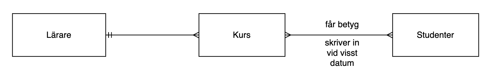
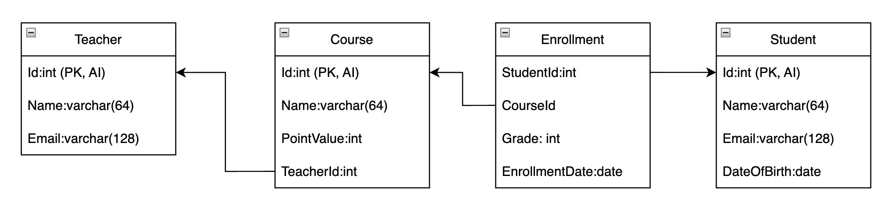

# SQL

SQL (*Structured Query Language*)
Med frågespråket SQL kan vi skapa databaser, tabeller och relationer, samt lägga till, ändra, ta bort och hämta data.  

Det här materialet är en introduktion till SQL med fokus på praktiska exempel.

All kod du ser i exemplen kan köras direkt mot en testdatabas, så att du själv kan prova.  

## Exempeldatabas

För att göra exemplen tydliga använder vi genomgående en **skoldatabas**.  
Den innehåller fyra tabeller:  

- **Students** – information om studenter  
- **Teachers** – information om lärare  
- **Courses** – information om kurser och vilken lärare som håller kursen  
- **Enrollments** – kopplingstabell mellan studenter och kurser, inklusive datum och betyg  

På så sätt kan vi visa vanliga scenarier i en databas:  
- *En-till-många-relationer* (t.ex. en lärare kan ha flera kurser)  
- *Många-till-många-relationer* (t.ex. en student kan gå flera kurser, och en kurs kan ha flera studenter)  
### Som ER-diagram
Som ER-diagram illustreras databasen såhär:


### Som relationsschema
Som relationsschema illustreras databasen såhär:


### Databasdefinition
Du kan använda koden nedan för att testa. Skapa först en databas (t.ex med namnet `dittnamn_schooldb`). Kopiera sedan detta och kör som SQL (exempeldata finns nedan):
```sql
-- Skapa Students-tabellen med auto-inkrement på Id
CREATE TABLE Students (
    Id INT AUTO_INCREMENT PRIMARY KEY,   -- Auto-inkrementerande Id
    Name VARCHAR(100),                   -- Studentens namn
    Email VARCHAR(100),                  -- Studentens e-post
    DateOfBirth DATE                     -- Studentens födelsedatum
);

-- Skapa Teachers-tabellen med auto-inkrement på Id
CREATE TABLE Teachers (
    Id INT AUTO_INCREMENT PRIMARY KEY,   -- Auto-inkrementerande Id
    Name VARCHAR(100),                   -- Lärarens namn
    Email VARCHAR(100)                   -- Lärarens e-post
);

-- Skapa Courses-tabellen med auto-inkrement på Id
CREATE TABLE Courses (
    Id INT AUTO_INCREMENT PRIMARY KEY,   -- Auto-inkrementerande Id
    Name VARCHAR(100),                   -- Namnet på kursen
    Credits INT,                         -- Antal poäng för kursen
    TeacherId INT                        -- Lärarens Id som håller kursen
);

-- Skapa Enrollments-tabellen (mellanliggande tabell för många-till-många)
CREATE TABLE Enrollments (
    Id INT AUTO_INCREMENT PRIMARY KEY,   -- Auto-inkrementerande Id
    StudentId INT,                       -- Studentens Id
    CourseId INT,                        -- Kursens Id
    EnrollmentDate DATE,                 -- Datum för registreringen
    Grade INT                           -- Betyg för kursen (0 - IG, 1 - G, 2 - VG)
);
```

Här finns exempeldata att fylla på med. Notera att exempeldatan kan skilja något från exemplen i denna dokumentation:


[📥 Ladda ner exempeldatabasen (schooldb_data.sql)](schooldb_data.sql)